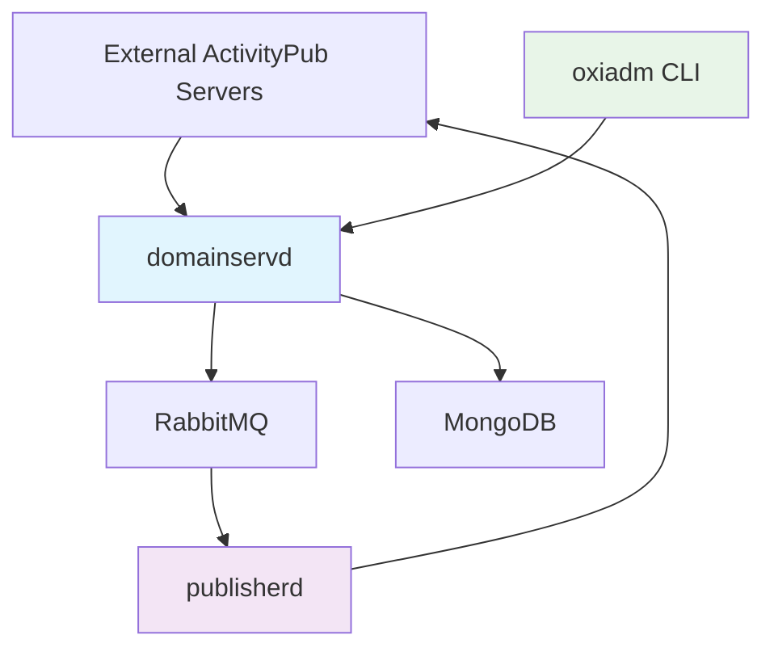

<div align="center">

# 🌐 Oxifed ActivityPub Platform

[](https://github.com/Toasterson/oxifed/actions)
[](https://github.com/Toasterson/oxifed/actions)
[](https://opensource.org/licenses/MPL-2.0)
[](https://www.rust-lang.org)
[](https://www.w3.org/TR/activitypub/)
[](https://github.com/sponsors/Toasterson)

**A comprehensive, modular ActivityPub platform for building federated social applications**

*Supporting microblogging, long-form blogging, and personal portfolio sites*

[🚀 Quick Start](#-quick-start) • [📚 Documentation](#-documentation) • [🏗️ Architecture](#️-core-components) • [🤝 Contributing](.github/CONTRIBUTING.md) • [💬 Community](#-community)

</div>

---

## ✨ Features

<table>
<tr>
<td>

🔗 **Federation Ready**
- Full ActivityPub compliance
- Compatible with Mastodon, Pleroma, PeerTube
- Multi-domain support

</td>
<td>

🛡️ **Secure by Design**
- HTTP signature authentication
- PKI-based trust system
- Rate limiting & monitoring

</td>
</tr>
<tr>
<td>

📱 **Multi-Application**
- Microblogging (Twitter-like)
- Blog platform (Medium-like)
- Portfolio sites

</td>
<td>

⚡ **High Performance**
- Rust-powered backend
- Async message processing
- Horizontal scaling ready

</td>
</tr>
</table>

## 📚 Documentation

| Document | Description |
|----------|-------------|
| 📋 [**Design Document**](DESIGN.md) | Complete platform architecture and feature specifications |
| 🏗️ [**Technical Architecture**](ARCHITECTURE.md) | Detailed implementation specifications and system design |
| 🤝 [**Contributing Guide**](.github/CONTRIBUTING.md) | How to contribute to the project |
| 📝 [**Changelog**](CHANGELOG.md) | Release notes and version history |

## 🚀 Quick Start

### Prerequisites

| Requirement | Version | Purpose |
|-------------|---------|---------|
| 🦀 Rust | 1.70+ | Core platform development |
| 🐳 Docker & Docker Compose | Latest | Development environment |
| 🍃 MongoDB | 6.0+ | Primary database |
| 🐰 RabbitMQ | 3.11+ | Message queue system |

### Running the Platform

<details>
<summary>🐳 <strong>Step 1: Start Infrastructure Services</strong></summary>

```bash
docker-compose up -d mongodb lavinmq
```

This starts MongoDB and RabbitMQ in the background.

</details>

<details>
<summary>🔨 <strong>Step 2: Build and Run Core Daemons</strong></summary>

```bash
# Build all components
cargo build --release

# Terminal 1: Run domain service daemon
cargo run --bin domainservd

# Terminal 2: Run publishing daemon  
cargo run --bin publisherd
```

</details>

<details>
<summary>🧪 <strong>Step 3: Test with CLI Tool</strong></summary>

```bash
# Register a domain first
cargo run --bin oxiadm -- domain create example.com \
  --name "Example Domain" \
  --description "A test domain" \
  --contact-email "admin@example.com"

# Create a user profile
cargo run --bin oxiadm -- profile create alice@example.com \
  --summary "Hello ActivityPub!"

# Publish your first note
cargo run --bin oxiadm -- note create alice@example.com \
  "Hello, federated world! 🌍"
```

</details>

> 💡 **Tip**: Use `cargo run --bin oxiadm -- help` to explore all available commands!

## 🏗️ Core Components

<div align="center">



</div>

The platform consists of three main daemons that work together to provide ActivityPub functionality:

### domainservd
The central ActivityPub server daemon that handles:
- **Inbox/Outbox APIs**: Serves ActivityPub endpoints for receiving and sending activities
- **WebFinger Protocol**: Enables actor discovery across the federation
- **Actor Management**: CRUD operations for user profiles and actor metadata
- **Multi-domain Support**: Hosts multiple domains with isolated configurations
- **Message Routing**: Distributes incoming activities to worker daemons via RabbitMQ
- **RPC Services**: Handles real-time domain queries via RabbitMQ RPC pattern

All external ActivityPub servers connect to domainservd, and it serves as the main entry point for internal applications. When messages are received at actor inboxes or the shared inbox, they are routed to the `INCOMING_EXCHANGE` for processing by specialized worker daemons. Domain queries use RPC pattern for real-time responses.

### publisherd
Specialized daemon for ActivityPub protocol compliance:
- **Activity Processing**: Listens on `EXCHANGE_ACTIVITYPUB_PUBLISH` for outgoing activities
- **Federation Logic**: Implements the complete ActivityPub specification from [W3C ActivityPub](https://www.w3.org/TR/activitypub/)
- **Delivery Management**: Handles reliable message delivery to remote ActivityPub servers
- **Protocol Compliance**: Ensures all outgoing activities meet ActivityPub standards

### oxiadm
Command-line administration and testing tool:
- **Domain Management**: Register and configure domains in the system
  - Asynchronous commands (create/update/delete) via fanout messaging
  - Synchronous queries (list/show) via RPC pattern with 30-second timeout
- **Profile Management**: Create and manage actor profiles and metadata
- **Content Publishing**: Publish notes, articles, and other ActivityPub objects
- **Social Interactions**: Follow accounts, like posts, and boost content across the federation
- **System Testing**: Provides smoke testing capabilities for federation connectivity
- **Administration**: Domain configuration and system management utilities

*Note: oxiadm is designed for administration and testing - it does not include content viewing capabilities.*

## 🛠️ Applications Built on Oxifed

<div align="center">

| Application Type | Description | Status |
|------------------|-------------|---------|
| 📱 **Microblogging** | Twitter/Mastodon-style short-form sharing | 🚧 In Progress |
| 📝 **Blog Platform** | Medium/Ghost-style long-form publishing | 📋 Planned |
| 💼 **Portfolio Sites** | Professional portfolio and networking | 📋 Planned |
| 🔧 **Custom Apps** | Extensible architecture for custom needs | ✅ Available |

</div>

## 🗄️ Infrastructure

<table>
<tr>
<th>Component</th>
<th>Technology</th>
<th>Purpose</th>
</tr>
<tr>
<td>🗃️ <strong>Database</strong></td>
<td>MongoDB</td>
<td>Actor profiles, activities, domain configuration</td>
</tr>
<tr>
<td>📨 <strong>Message Queue</strong></td>
<td>RabbitMQ</td>
<td>
• Fanout exchanges for async processing<br>
• Direct exchanges for RPC queries<br>
• Correlation IDs and timeouts
</td>
</tr>
<tr>
<td>🌐 <strong>Federation</strong></td>
<td>ActivityPub</td>
<td>Interoperability with Mastodon, Pleroma, PeerTube</td>
</tr>
</table>

## 📖 Getting Started

```mermaid
graph LR
    A[📖 Read Docs] --> B[🚀 Quick Start]
    B --> C[🏗️ Register Domain]
    C --> D[👤 Create Profile]
    D --> E[🌐 Test Federation]
    
    style A fill:#e3f2fd
    style B fill:#f1f8e9
    style C fill:#fff3e0
    style D fill:#fce4ec
    style E fill:#e8f5e8
```

<div align="center">



</div>

### 🛤️ Learning Path

1. 📋 **Read the [Design Document](DESIGN.md)** - Get a comprehensive overview
2. 🏗️ **Check [Technical Architecture](ARCHITECTURE.md)** - Understand implementation details  
3. 🚀 **Follow the [Quick Start](#-quick-start)** - Run your first instance
4. 🏷️ **Register your domain** using `oxiadm domain create`
5. 👤 **Create user profiles** and test federation
6. 🤝 **Join the community** and start contributing!

### 🎯 Next Steps

- 🐛 **Found a bug?** [Report it](.github/ISSUE_TEMPLATE/bug_report.md)
- 💡 **Have an idea?** [Request a feature](.github/ISSUE_TEMPLATE/feature_request.md)
- 🤝 **Want to contribute?** Read our [Contributing Guide](.github/CONTRIBUTING.md)
- 💬 **Need help?** Check our [Discussions](../../discussions)

## 🤝 Community

<div align="center">

[](https://github.com/Toasterson/oxifed/graphs/contributors)
[](https://github.com/Toasterson/oxifed/stargazers)
[](https://github.com/Toasterson/oxifed/network)
[](https://github.com/Toasterson/oxifed/issues)

**Join our growing community of developers building the future of federated social media!**

[💬 Discussions](../../discussions) • [🐛 Issues](../../issues) • [🔄 Pull Requests](../../pulls) • [📖 Wiki](../../wiki)

</div>

## 💖 Support the Project

<div align="center">

If you find Oxifed useful, consider supporting its development:

[](https://github.com/sponsors/Toasterson)
[](https://github.com/Toasterson/oxifed)

**Every contribution helps make federated social media better for everyone!**

</div>

## 📄 License

This project is licensed under the [Mozilla Public License 2.0](LICENSE) - see the LICENSE file for details.

---

<div align="center">

**Made with ❤️ by the Oxifed community**

*Building a more open and decentralized web, one commit at a time.*

</div>
